<!-- README.md is generated from README.Rmd. Please edit that file -->

# iNEXT.scaling (R package)

<h5 align="right">
Latest version: 2025-12-29
</h5>
<font color="394CAE">
<h3 color="394CAE" style="font-weight: bold">
Introduction to iNEXT.scaling (R package): Excerpt from iNEXT.scaling
User’s Guide
</h3>
</font> <br>
<h5>
<b>Kai-Hsiang Hu and Anne Chao</b> <br><br> <i>Institute of Statistics,
National Tsing Hua University, Hsin-Chu, Taiwan 30043</i>
</h5>

<br> `iNEXT.scaling` (INterpolation and EXTrapolation for upscaling
biodiversity) is a sequel to
[iNEXT](https://cran.r-project.org/web/packages/iNEXT/index.html) (Hsieh
et al., 2016) and
[iNEXT.3D](https://cran.r-project.org/web/packages/iNEXT.3D/index.html)
(Chao et al., 2021). `iNEXT.scaling` estimates the Hill numbers (also
called taxonomic diversity) under the sampling without replacement
model. An online version “iNEXT.scaling Online”
(<https://kaihsiang-hu.shinyapps.io/iNEXT_scaling/>) is also available
for users without an R background.

`iNEXT.scaling` features two statistical analyses (non-asymptotic and
asymptotic):

1.  A non-asymptotic approach based on interpolation and extrapolation
    for diversity

`iNEXT.scaling` computes the estimated Hill numbers for standardized
samples with a common sample size or sample completeness. This approach
aims to compare diversity estimates for equally-large (with a common
sample size) or equally-complete (with a common sample coverage)
samples; it is based on the seamless rarefaction and extrapolation (R/E)
sampling curves of Hill-Chao numbers for q = 0, 1 and 2. `iNEXT.scaling`
offers three types of R/E sampling curves:

-   Sample-size-based (or size-based) R/E sampling curves: This type of
    sampling curve plots the diversity estimates with respect to sample
    size.

-   Coverage-based R/E sampling curves: This type of sampling curve
    plots the diversity estimates with respect to sample coverage.

-   Sample completeness curve: This curve depicts how sample coverage
    varies with sample size. The sample completeness curve provides a
    bridge between the size- and coverage-based R/E sampling curves.

1.  An asymptotic approach to infer asymptotic diversity for Hill
    numbers

`iNEXT.scaling` computes the estimated asymptotic diversity and also
plots diversity profiles (q-profiles) for q between 0 and 2, in
comparison with the observed diversity. Typically, the asymptotic
estimates for q ≥ 1 are reliable, but for q \< 1 (especially for q = 0,
species richness), the asymptotic estimates represent only lower bounds.

## How to cite

If you publish your work based on results from `iNEXT.scaling` package,
you should make references to the following methodology paper and the
package:

-   Hu, K.-H. and Chao, A. (2025). The iNEXT.scaling package:
    INterpolation and EXTrapolation for upscaling biodiversity. R
    package available from CRAN.

## SOFTWARE NEEDED TO RUN iNEXT.scaling IN R

-   Required: [R](https://cran.r-project.org/)
-   Suggested: [RStudio
    IDE](https://www.rstudio.com/products/RStudio/#Desktop)

## HOW TO RUN iNEXT.scaling:

The `iNEXT.scaling` package can be downloaded from CRAN or Kai-Hsiang
Hu’s
[iNEXT.scaling_github](https://github.com/KaiHsiangHu/iNEXT.scaling)
using the commands below. For a first-time installation, some additional
packages must be installed and loaded; see package manual.

``` r
## install iNEXT.scaling package from CRAN
install.packages("iNEXT.scaling")  

## or install the latest version from github
install.packages('devtools')
library(devtools)
install_github('KaiHsiangHu/iNEXT.scaling')

## import packages
library(iNEXT.scaling)
```

There are six main functions in this package:

Two functions for non-asymptotic analysis with graphical displays:

-   **iNEXTscaling** computes standardized diversity estimates of order
    q = 0, 1 and 2 for rarefied and extrapolated samples at specified
    sample coverage values and sample sizes.

-   **ggiNEXTscaling** visualizes the output from the function
    `iNEXTscaling`.

Two functions for point estimation and basic data information

-   **estimatescaling** computes diversity of order q = 0, 1 and 2 with
    a particular set of user-specified level of sample sizes or sample
    coverage values.

-   **DataInfoscaling** provides basic data information based on the
    observed data.

Two functions for asymptotic analysis with graphical displays:

-   **ObsAsyscaling** computes observed and asymptotic diversity of
    order q between 0 and 2 (in increments of 0.2) for Hill numbers.

-   **ggObsAsyscaling** visualizes the output from the function
    `ObsAsyscaling`.

## <span style="color:red;">DATA INPUT FORMAT</span>

### Species abundance/incidence data format

For `iNEXT.IE` package, information on species identity (or any unique
identification code) and assemblage affiliation is not required. Two
types of species abundance/incidence data are supported:

1.  Individual-based abundance data (`datatype = "abundance"`): When
    there are multiple assemblages, in addition to the assemblage/site
    names (as column names) and the species names (as row names),
    species abundance data (reference sample) can be input as a species
    (in rows) by assemblage (in columns) matrix/data.frame or a list of
    species abundance vectors. In the special case that there is only
    one assemblage, all data should be read in one column.

2.  Sampling-unit-based incidence data: Incidence-raw data
    (`datatype = "incidence_raw"`): for each assemblage, input data for
    a reference sample consist of a species-by-sampling-unit matrix, in
    addition to the sampling-unit names (as column names) and the
    species names (as row names). When there are N assemblages, input
    data consist of N lists of matrices, and each matrix is a
    species-by-sampling-unit matrix. Each element in the incidence raw
    matrix is 1 for a detection, and 0 for a non-detection. Input a
    matrix which combines data for all assemblages is allowed, but the
    argument `nT` in the function `iNEXTscaling` must be specified so
    that the number of sampling units in each assemblage is specified.

For example, the dataset `Brazil_rainforest_abun_data` included in the
`iNEXT.scaling` package consists of species sample abundances of two
assemblages/habitats: “Edge” and “Interior”. Run the following code to
view the first 15 rows of the abundance data.

``` r
data("Brazil_rainforest_abun_data")
Brazil_rainforest_abun_data
```

                             Edge Interior
    Carpotroche_brasiliensis   11       21
    Astronium_concinnum       110       11
    Astronium_graveolens       36        7
    Spondias_macrocarpa        12        1
    Spondias_venulosa           2        0
    Tapirira_guianensis         7        1
    Thyrsodium_spruceanum      11       11
    Anaxagorea_silvatica        1       13
    Annona_acutiflora           1        1
    Annona_cacans               0        2
    Annona_dolabripetala        3        3
    Annona_sp                   0        1
    Duguetia_chrysocarpa        1        1
    Ephedranthus_sp1            1        0
    Ephedranthus_sp2            0        1

We use data (`Fish_incidence_data`) collected from two time periods,
namely `"2013-2015"` and `"2016-2018"`, as an example. Each time period
is designated as an assemblage. The purpose was to compare diversity of
the two time periods. In each time period, species incidence/occurrence
was recorded in 36 sampling units in each assemblage; each sampling unit
represents a sampling date. Thus, there are 36 columns in each time
period. Run the following code to view the first 6 rows and 6 columns
for each matrix.

``` r
data("Fish_incidence_data")
Fish_incidence_data
```

    $`2013-2015`
                        17/01/2013 18/02/2013 19/03/2013 17/04/2013 16/05/2013 14/06/2013
    Agonus_cataphractus          0          1          1          1          0          0
    Alosa_fallax                 0          0          0          0          0          0
    Ammodytes_tobianus           0          0          0          0          0          0
    Anguilla_anguilla            0          1          1          0          0          0
    Aphia_minuta                 0          0          0          0          1          1
    Arnoglossus_laterna          0          0          0          0          0          0

    $`2016-2018`
                        18/01/2016 15/02/2016 16/03/2016 14/04/2016 12/05/2016 10/06/2016
    Agonus_cataphractus          1          1          1          1          1          0
    Alosa_fallax                 0          0          0          0          0          0
    Ammodytes_tobianus           0          0          0          0          0          0
    Anguilla_anguilla            0          0          0          0          0          0
    Aphia_minuta                 0          0          0          0          1          0
    Arnoglossus_laterna          0          0          0          0          0          0

## <span style="color:red;">MAIN FUNCTION iNEXTscaling(): RAREFACTION/EXTRAPOLATION</span>

We first describe the main function `iNEXTscaling()` with default
arguments:

``` r
iNEXTscaling(data, rho, q = c(0, 1, 2), datatype = "abundance", size = NULL, endpoint = NULL, knots = 40, nboot = 50, conf = 0.95, nT = NULL)
```

The arguments of this function are briefly described below, and will be
explained in more detail by illustrative examples in later sections.
This main function computes standardized diversity estimates of order q
= 0, 1 and 2, the sample coverage estimates, and related statistics for
K (if `knots = K` in the specified argument) evenly-spaced knots (sample
sizes) between size 1 and the `endpoint`, where the endpoint is
described below. Each knot represents a particular sample size for which
diversity estimates will be calculated. By default, `endpoint` = the
maximum sample sizes or sampling units (see arguments). For example, if
`endpoint = 10`, `knot = 4` is specified, diversity estimates will be
computed for a sequence of samples with sizes (1, 4, 7, 10).

<table class='gmisc_table' style='border-collapse: collapse; margin-top: 1em; margin-bottom: 1em;' >
<thead>
<tr>
<th style="font-weight: 900; border-bottom: 1px solid grey; border-top: 2px solid grey; text-align: center;">
Argument
</th>
<th style="font-weight: 900; border-bottom: 1px solid grey; border-top: 2px solid grey; text-align: center;">
Description
</th>
</tr>
</thead>
<tbody>
<tr>
<td style="text-align: left;">
data
</td>
<td style='text-align: left;'>

1.  For <code>datatype = ‘abundance’</code>, data can be input as a
    vector of species abundances (for a single assemblage),
    matrix/data.frame (species by assemblages), or a list of species
    abundance vectors.
2.  For <code>datatype = ‘incidence_raw’</code>, data can be input as a
    list of matrices/data.frames (species by sampling units); data can
    also be input as a single matrix/data.frame by merging all sampling
    units across assemblages based on species identity; in this case,
    the number of sampling units (nT, see below) must be specified.
    </td>
    </tr>
    <tr>
    <td style="text-align: left;">
    rho
    </td>
    <td style="text-align: left;">
    the sampling fraction can be input as a vector for each assemblage,
    or specify a single numeric value to apply to all assemblages.
    </td>
    </tr>
    <tr>
    <td style="text-align: left;">
    q
    </td>
    <td style="text-align: left;">
    a numerical vector specifying the diversity orders. Default is
    <code>c(0, 1, 2)</code>.
    </td>
    </tr>
    <tr>
    <td style="text-align: left;">
    datatype
    </td>
    <td style="text-align: left;">
    data type of input data: individual-based abundance data
    (<code>datatype = ‘abundance’</code>), or species by sampling-units
    incidence/occurrence matrix (<code>datatype =
    ‘incidence_raw’</code>) with all entries being 0 (non-detection) or
    1 (detection).
    </td>
    </tr>
    <tr>
    <td style="text-align: left;">
    size
    </td>
    <td style="text-align: left;">
    an integer vector of sample sizes (number of individuals or sampling
    units) for which diversity estimates will be computed. If
    <code>NULL</code>, then diversity estimates will be computed for
    those sample sizes determined by the specified/default
    <code>endpoint</code> and <code>knots</code>.
    </td>
    </tr>
    <tr>
    <td style="text-align: left;">
    endpoint
    </td>
    <td style="text-align: left;">
    an integer specifying the sample size that is the
    <code>endpoint</code> for rarefaction/extrapolation. If NULL, then
    <code>endpoint</code> <code>=</code> the maximum sample sizes, which
    is set to double the reference sample size when `rho` is less than
    0.2; triple the reference sample size when `rho` is between 0.2 and
    0.4; and the total number of individuals when `rho` exceeds 0.4.
    </td>
    </tr>
    <tr>
    <td style="text-align: left;">
    knots
    </td>
    <td style="text-align: left;">
    an integer specifying the number of equally-spaced
    <code>knots</code> (say K, default is 40) between size 1 and the
    <code>endpoint</code>; each knot represents a particular sample size
    for which diversity estimate will be calculated. If the
    <code>endpoint</code> is smaller than the reference sample size,
    then <code>iNEXT3D()</code> computes only the rarefaction estimates
    for approximately K evenly spaced <code>knots</code>. If the
    <code>endpoint</code> is larger than the reference sample size, then
    <code>iNEXT3D()</code> computes rarefaction estimates for
    approximately K/2 evenly spaced <code>knots</code> between sample
    size 1 and the reference sample size, and computes extrapolation
    estimates for approximately K/2 evenly spaced <code>knots</code>
    between the reference sample size and the <code>endpoint</code>.
    </td>
    </tr>
    <tr>
    <td style="text-align: left;">
    nboot
    </td>
    <td style="text-align: left;">
    a positive integer specifying the number of bootstrap replications
    when assessing sampling uncertainty and constructing confidence
    intervals. Enter 0 to skip the bootstrap procedures. Default is 50.
    </td>
    </tr>
    <tr>
    <td style="text-align: left;">
    conf
    </td>
    <td style="text-align: left;">
    a positive number \< 1 specifying the level of confidence interval.
    Default is 0.95.
    </td>
    </tr>
    <tr>
    <td style="border-bottom: 2px solid grey; text-align: left;">
    nT
    </td>
    <td style="border-bottom: 2px solid grey; text-align: left;">
    (required only when <code>datatype = ‘incidence_raw’</code> and
    input data in a single matrix/data.frame) a vector of nonnegative
    integers specifying the number of sampling units in each assemblage.
    If assemblage names are not specified(i.e., <code>names(nT) =
    NULL</code>), then assemblages are automatically named as
    ‘Assemblage_1’, ‘Assemblage_2’,…, etc.
    </td>
    </tr>
    </tbody>
    </table>

The main function `iNEXTscaling()` returns the `iNEXTscaling` object,
which can be further used to make plots using the function
`ggiNEXTscaling()` to be described below. The `"iNEXTscaling"` object
includes three lists:

1.  `$TDInfo` for summarizing data information.

2.  `$TDiNextEst` for showing diversity estimates along with related
    statistics for a series of rarefied and extrapolated samples; there
    are two data frames (`$size_based` and `$coverage_based`)
    conditioning on standardized sample size or sample coverage,
    respectively.

3.  `$TDAsyEst` for showing asymptotic diversity estimates along with
    related statistics.

## <span style="color:red;">FUNCTION ggiNEXTscaling(): GRAPHIC DISPLAYS</span>

The function `ggiNEXTscaling()`, which extends `ggplot2` with default
arguments, is described as follows:

``` r
ggiNEXTscaling(output, type = 1:3, facet.var = "Assemblage", color.var = "Order.q")  
```

Here `output` is the `iNEXTscaling()` object. Three types of curves are
allowed for diversity:

1.  Sample-size-based R/E curve (`type = 1`): This curve plots diversity
    estimates with confidence intervals as a function of sample size.

2.  Sample completeness curve (`type = 2`): This curve plots the sample
    coverage with respect to sample size.

3.  Coverage-based R/E curve (`type = 3`): This curve plots the
    diversity estimates with confidence intervals as a function of
    sample coverage.

The argument `facet.var = "Order.q"`, `facet.var = "Assemblage"`,
`facet.var = "Both"`, or `facet.var = "None"` is used to create a
separate plot for each value of the specified variable.

The `ggiNEXTscaling()` function is a wrapper with the package `ggplot2`
to create a rarefaction/extrapolation sampling curve in a single line of
code. The figure object is of class `"ggplot"`, so it can be manipulated
by using the `ggplot2` tools.

## <span style="color:blue;">TAXONOMIC DIVERSITY (TD): RAREFACTION/EXTRAPOLATION VIA EXAMPLES</span>

### EXAMPLE 1: TD rarefaction/extrapolation for abundance data

Based on the dataset (`Brazil_rainforest_abun_data`) included in the
package, the following commands return all numerical results for `TD`.
Assume that the rho of data is 0.3. The first list of the output
(`$TDInfo`) returns basic data information including the name of the
Assemblage, sample size (`n`), total abundance in the overall assemblage
(`N`), sampling fraction of the reference sample (`rho`), observed
species richness (`S.obs`), sample coverage estimate of the reference
sample with size n (`SC(n)`), sample coverage estimate of the
extrapolated sample with size 2n (`SC(2n)`) as well as the first five
species abundance frequency counts in the reference sample (`f1-f5`).
The output is identical to that based on the function
`DataInfoscaling()` by specifying `datatype = "abundance"`; see later
text. Thus, if only data information is required, the simpler function
`DataInfoscaling()` (see later text) can be used to obtain the same
output. More information about the observed diversity (for any order q
between 0 and 2) can be obtained by function `ObsAsyscaling()`, which
will be introduced later.

``` r
data(Brazil_rainforest_abun_data)
output_TD_abun <- iNEXTscaling(Brazil_rainforest_abun_data, rho = 0.3, 
                               q = c(0, 1, 2), datatype = "abundance")
output_TD_abun$TDInfo
```

    $TDInfo
      Assemblage    n    N rho S.obs SC(n) SC(2n)  f1 f2 f3 f4 f5
    1       Edge 1794 5980 0.3   319 0.957  0.992 110 48 38 28 13
    2   Interior 2074 6913 0.3   356 0.958  0.991 123 48 41 32 19

The second list of the output (`$TDiNextEst`) includes size- and
coverage-based standardized diversity estimates and related statistics
computed for 40 knots by default (for example in the “Edge” assemblage,
corresponding to the target sample size `m` = 1, 95, 189, …, 1699, 1794,
1795, 1983, …, 5382), which locates the reference sample size at the
mid-point of the selected knots. There are two data frames
(`$size_based` and `$coverage_based`).

The first data frame (`$size_based`) includes the name of the
Assemblage, diversity order (`Order.q`), the target sample size (`m`),
the `Method` (`Rarefaction`, `Observed`, or `Extrapolation`, depending
on whether the size `m` is less than, equal to, or greater than the
reference sample size), the diversity estimate of order q (`qTD`), the
lower and upper confidence limits of diversity (`qTD.LCL` and `qTD.UCL`)
conditioning on the sample size, and the corresponding sample coverage
estimate (`SC`) along with the lower and upper confidence limits of
sample coverage (`SC.LCL` and `SC.UCL`). These sample coverage estimates
with confidence intervals are used for plotting the sample completeness
curve. If the argument `nboot` is greater than zero, then a bootstrap
method is applied to obtain the confidence intervals for the diversity
and sample coverage estimates. Otherwise, all confidence intervals will
not be computed. Here only the first six rows of the `$size_based`
output are displayed:

``` r
output_TD_abun$TDiNextEst$size_based
```

      Assemblage Order.q   m      Method     qTD qTD.LCL qTD.UCL    SC SC.LCL SC.UCL
    1       Edge       0   1 Rarefaction   1.000   1.000   1.000 0.012  0.011  0.013
    2       Edge       0  95 Rarefaction  66.306  65.275  67.337 0.492  0.480  0.505
    3       Edge       0 189 Rarefaction 106.743 104.693 108.793 0.649  0.638  0.660
    4       Edge       0 284 Rarefaction 137.029 134.083 139.975 0.732  0.721  0.742
    5       Edge       0 378 Rarefaction 161.010 157.232 164.789 0.783  0.773  0.793
    6       Edge       0 472 Rarefaction 181.073 176.494 185.652 0.819  0.809  0.828

The second data frame (`$coverage_based`) includes the name of
assemblage, the diversity order (`Order.q`), the target sample coverage
value (`SC`), the corresponding sample size (`m`), the `Method`
(`Rarefaction`, `Observed`, or `Extrapolation`, depending on whether the
coverage `SC` is less than, equal to, or greater than the reference
sample coverage), the diversity estimate of order q (`qTD`), the lower
and upper confidence limits of diversity (`qTD.LCL` and `qTD.UCL`)
conditioning on the target sample coverage value. Here only the first
six rows of the `$coverage_based` output are displayed below: (Note for
a fixed coverage value, the confidence interval in the `$coverage_based`
table is wider than the corresponding interval in the `$size_based`
table. This is because, for a given coverage value, the sample size
needed to attain a fixed coverage value varies with bootstrap
replication, leading to higher uncertainty on the resulting diversity
estimate.)

``` r
output_TD_abun$TDiNextEst$coverage_based
```

      Assemblage Order.q    SC   m      Method     qTD qTD.LCL qTD.UCL
    1       Edge       0 0.012   1 Rarefaction   1.000   0.914   1.086
    2       Edge       0 0.492  95 Rarefaction  66.306  62.777  69.834
    3       Edge       0 0.649 189 Rarefaction 106.743 101.479 112.008
    4       Edge       0 0.732 284 Rarefaction 137.029 130.229 143.830
    5       Edge       0 0.783 378 Rarefaction 161.010 152.803 169.217
    6       Edge       0 0.819 472 Rarefaction 181.073 171.557 190.590

The third list of the output (`$TDAsyEst`) includes the name of the
Assemblage, diversity label (`qTD`, species richness for q = 0, Shannon
diversity for q = 1, and Simpson diversity for q = 2), the observed
diversity (`TD_obs`), asymptotic diversity estimate (`TD_asy`) and its
estimated bootstrap standard error (`s.e.`) as well as the confidence
intervals for asymptotic diversity (`qTD.LCL` and `qTD.UCL`). These
statistics are computed only for q = 0, 1 and 2. More detailed
information about asymptotic and observed diversity estimates for any
order q between 0 and 2 can be obtained from function `ObsAsyscaling()`.
The output for `$TDAsyEst` is shown below:

``` r
output_TD_abun$TDAsyEst
```

      Assemblage               qTD  TD_obs  TD_asy   s.e. qTD.LCL qTD.UCL
    1       Edge  Species richness 319.000 403.499 15.020 374.061 432.938
    2       Edge Shannon diversity 155.386 170.756  4.847 161.256 180.257
    3       Edge Simpson diversity  82.023  84.702  4.278  76.318  93.087
    4   Interior  Species richness 356.000 457.700 20.483 417.554 497.847
    5   Interior Shannon diversity 163.514 179.341  5.367 168.822 189.860
    6   Interior Simpson diversity  72.153  73.929  4.427  65.252  82.606

The `ggiNEXTscaling` function can be used to make graphical displays for
rarefaction and extrapolation sampling curves. When
`facet.var = "Assemblage"` is specified in the `ggiNEXTscaling`
function, it creates a separate plot for each assemblage; within each
assemblage, different color curves represent diversity of different
orders. An example for showing sample-size-based
rarefaction/extrapolation curves (`type = 1`) is given below:

``` r
# TD sample-size-based R/E curves, separating by "Assemblage"
ggiNEXTscaling(output_TD_abun, type = 1, facet.var = "Assemblage")
```

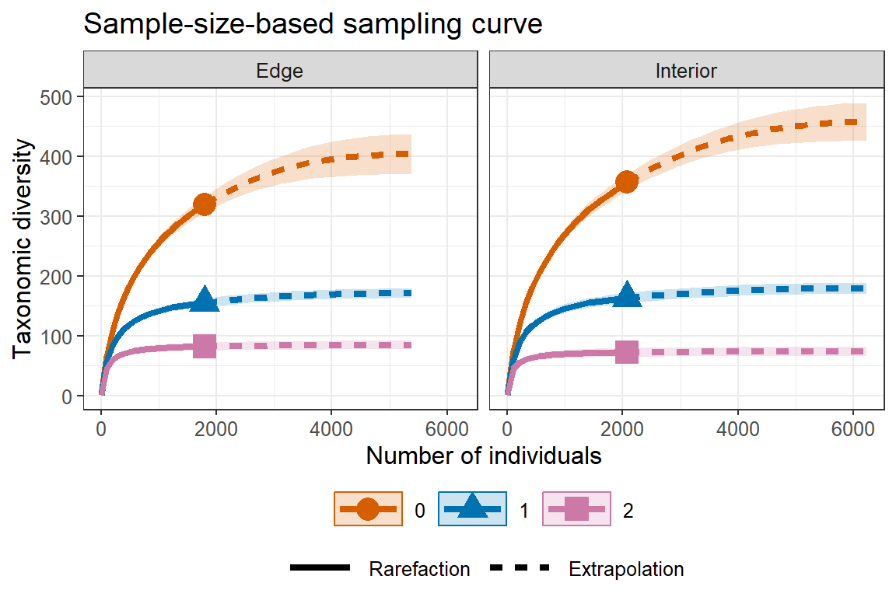

When `facet.var = "Order.q"` is specified in the `ggiNEXTscaling`
function, it creates a separate plot for each diversity order; within
each plot, different color curves represent different assemblages. An
example is shown below:

``` r
# TD sample-size-based R/E curves, separating by "Order.q"
ggiNEXTscaling(output_TD_abun, type = 1, facet.var = "Order.q")
```

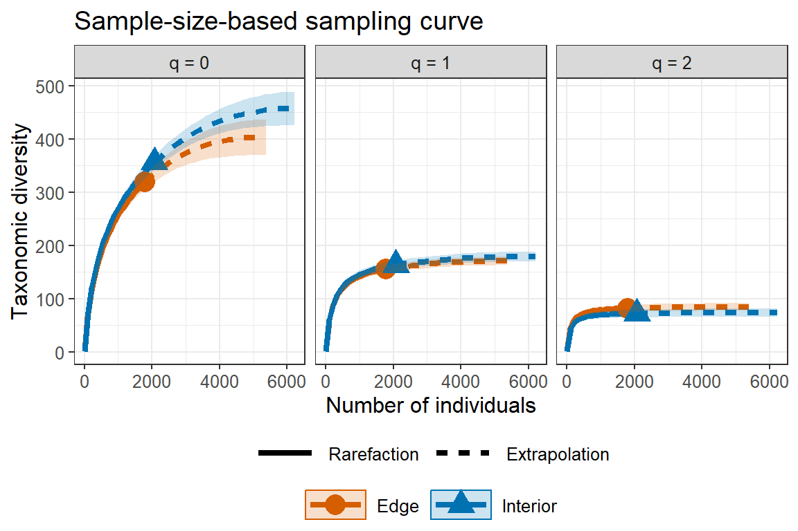

The following commands return the sample completeness (sample coverage)
curve (`type = 2`) in which different colors represent different
assemblages.

``` r
# Sample completeness curves for abundance data, separating by "Assemblage"
ggiNEXTscaling(output_TD_abun, type = 2, color.var = "Assemblage")
```

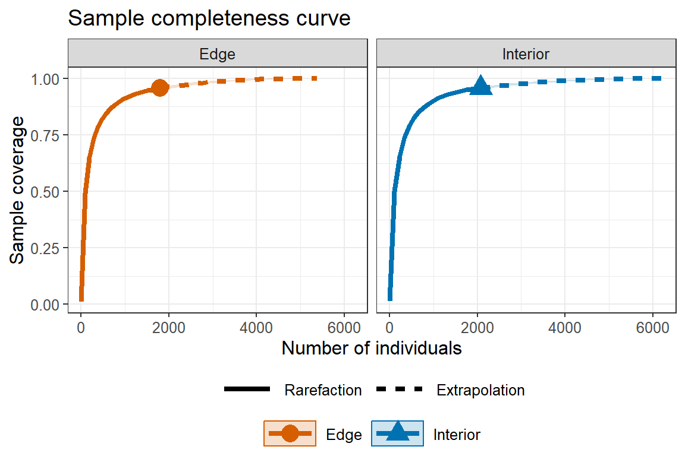

The following commands return the coverage-based
rarefaction/extrapolation sampling curves in which different color
curves represent three diversity orders within each assemblage
(`facet.var = "Assemblage"`), or represent two assemblages within each
diversity order (`facet.var = "Order.q"`), respectively.

``` r
# TD coverage-based R/E curves, separating by "Assemblage"
ggiNEXTscaling(output_TD_abun, type = 3, facet.var = "Assemblage")
```

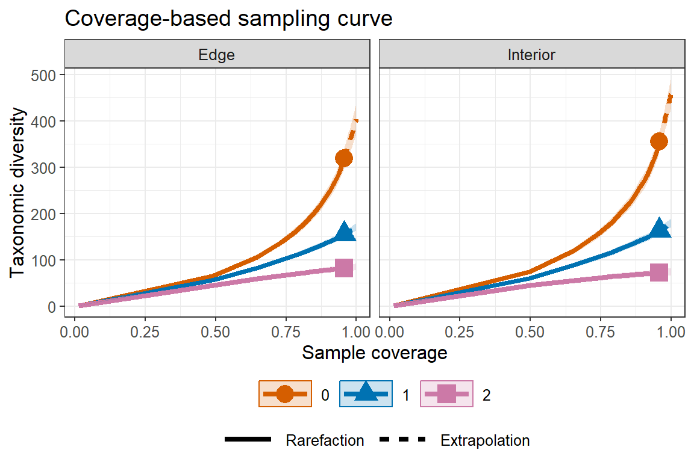

``` r
# TD coverage-based R/E curves, separating by "Order.q"
ggiNEXTscaling(output_TD_abun, type = 3, facet.var = "Order.q")
```


### EXAMPLE 2: TD rarefaction/extrapolation for incidence data

Based on the dataset (`Fish_incidence_data`) included in the package,
the following commands return all numerical results for `TD`. Assume
that the rho of data is 0.3. The first list of the output (`$TDInfo`)
returns basic data information including the name of the Assemblage,
number of sampling units (`T`), total number of sampling units in the
overall assemblage (`T*`), sampling fraction of the reference sample
(`rho`), total number of incidences (`U`), observed species richness
(`S.obs`), sample coverage estimate of the reference sample with size T
(`SC(T)`), sample coverage estimate of the extrapolated sample with size
2T (`SC(2T)`) as well as the first five species incidence frequency
counts in the reference sample (`Q1-Q5`). The output is identical to
that based on the function `DataInfoscaling()` by specifying
`datatype = "incidence_raw"`; see later text. Thus, if only data
information is required, the simpler function `DataInfoscaling()` (see
later text) can be used to obtain the same output. More information
about the observed diversity (for any order q between 0 and 2) can be
obtained by function `ObsAsyscaling()`, which will be introduced later.

``` r
data(Fish_incidence_data)
output_TD_inci <- iNEXTscaling(Fish_incidence_data, rho = 0.3, 
                               q = c(0, 1, 2), datatype = "incidence_raw")
output_TD_inci$TDInfo
```

    $TDInfo
      Assemblage  T  T* rho   U S.obs SC(T) SC(2T) Q1 Q2 Q3 Q4 Q5
    1  2013-2015 36 120 0.3 532    50 0.986  0.998 11  6  4  1  3
    2  2016-2018 36 120 0.3 522    53 0.983  0.996 13  5  5  2  3

The second list of the output (`$TDiNextEst`) includes size- and
coverage-based standardized diversity estimates and related statistics
computed for 40 knots by default (for example in the `"2013-2015"` time
period, corresponding to the target number of sample units `mT` = 1, 2,
4, …, 34, 36, 37, 40, …, 108), which locates the reference sampling
units at the mid-point of the selected knots. There are two data frames
(`$size_based` and `$coverage_based`).

The first data frame (`$size_based`) includes the name of the
Assemblage, diversity order (`Order.q`), the target number of sampling
units (`mT`), the `Method` (`Rarefaction`, `Observed`, or
`Extrapolation`, depending on whether the target number of sample units
`mT` is less than, equal to, or greater than the number of sampling
units in the reference sample), the diversity estimate of order q
(`qTD`), the lower and upper confidence limits of diversity (`qTD.LCL`
and `qTD.UCL`) conditioning on the sample size, and the corresponding
sample coverage estimate (`SC`) along with the lower and upper
confidence limits of sample coverage (`SC.LCL` and `SC.UCL`). These
sample coverage estimates with confidence intervals are used for
plotting the sample completeness curve. If the argument `nboot` is
greater than zero, then a bootstrap method is applied to obtain the
confidence intervals for the diversity and sample coverage estimates.
Otherwise, all confidence intervals will not be computed. Here only the
first six rows of the `$size_based` output are displayed:

``` r
output_TD_inci$TDiNextEst$size_based
```

      Assemblage Order.q mT      Method    qTD qTD.LCL qTD.UCL    SC SC.LCL SC.UCL
    1  2013-2015       0  1 Rarefaction 14.778  14.104  15.451 0.609  0.584  0.635
    2  2013-2015       0  2 Rarefaction 20.603  19.773  21.434 0.753  0.733  0.773
    3  2013-2015       0  4 Rarefaction 27.079  26.026  28.133 0.856  0.838  0.873
    4  2013-2015       0  6 Rarefaction 31.121  29.867  32.376 0.900  0.884  0.915
    5  2013-2015       0  8 Rarefaction 34.042  32.556  35.527 0.924  0.911  0.938
    6  2013-2015       0 10 Rarefaction 36.319  34.588  38.050 0.939  0.927  0.951

The second data frame (`$coverage_based`) includes the name of
assemblage, the diversity order (`Order.q`), the target sample coverage
value (`SC`), the corresponding number of sampling units (`mT`), the
`Method` (`Rarefaction`, `Observed`, or `Extrapolation`, depending on
whether the coverage `SC` is less than, equal to, or greater than the
reference sample coverage), the diversity estimate of order q (`qTD`),
the lower and upper confidence limits of diversity (`qTD.LCL` and
`qTD.UCL`) conditioning on the target sample coverage value. Here only
the first six rows of the `$coverage_based` output are displayed below:
(Note for a fixed coverage value, the confidence interval in the
`$coverage_based` table is wider than the corresponding interval in the
`$size_based` table. This is because, for a given coverage value, the
sample size needed to attain a fixed coverage value varies with
bootstrap replication, leading to higher uncertainty on the resulting
diversity estimate.)

``` r
output_TD_inci$TDiNextEst$coverage_based
```

      Assemblage Order.q    SC mT      Method    qTD qTD.LCL qTD.UCL
    1  2013-2015       0 0.609  1 Rarefaction 14.777  13.611  15.944
    2  2013-2015       0 0.753  2 Rarefaction 20.603  19.337  21.869
    3  2013-2015       0 0.856  4 Rarefaction 27.079  25.338  28.820
    4  2013-2015       0 0.900  6 Rarefaction 31.121  28.894  33.349
    5  2013-2015       0 0.924  8 Rarefaction 34.042  31.383  36.700
    6  2013-2015       0 0.939 10 Rarefaction 36.319  33.266  39.372

The third list of the output (`$TDAsyEst`) includes the name of the
Assemblage, diversity label (`qTD`, species richness for q = 0, Shannon
diversity for q = 1, and Simpson diversity for q = 2), the observed
diversity (`TD_obs`), asymptotic diversity estimate (`TD_asy`) and its
estimated bootstrap standard error (`s.e.`) as well as the confidence
intervals for asymptotic diversity (`qTD.LCL` and `qTD.UCL`). These
statistics are computed only for q = 0, 1 and 2. More detailed
information about asymptotic and observed diversity estimates for any
order q between 0 and 2 can be obtained from function `ObsAsyscaling()`.
The output is shown below:

``` r
output_TD_inci$TDAsyEst
```

      Assemblage               qTD TD_obs TD_asy  s.e. qTD.LCL qTD.UCL
    1  2013-2015  Species richness 50.000 57.196 5.695  46.035  68.357
    2  2013-2015 Shannon diversity 30.089 31.103 1.008  29.128  33.078
    3  2013-2015 Simpson diversity 23.961 24.260 0.721  22.847  25.672
    4  2016-2018  Species richness 53.000 63.795 5.722  52.579  75.010
    5  2016-2018 Shannon diversity 31.534 32.802 0.982  30.878  34.726
    6  2016-2018 Simpson diversity 24.889 25.248 0.675  23.924  26.571

The `ggiNEXTscaling` function can be used to make graphical displays for
rarefaction and extrapolation sampling curves. When
`facet.var = "Assemblage"` is specified in the `ggiNEXTscaling`
function, it creates a separate plot for each assemblage; within each
assemblage, different color curves represent diversity of different
orders. An example for showing sample-size-based
rarefaction/extrapolation curves (`type = 1`) for incidence data is
given below:

``` r
# TD sample-size-based R/E curves for incidence data, separating by "Assemblage"
ggiNEXTscaling(output_TD_inci, type = 1, facet.var = "Assemblage")
```

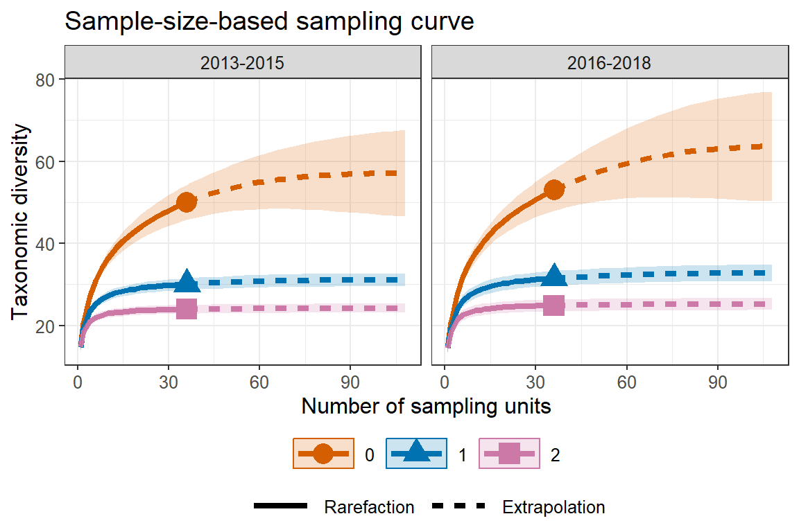

When `facet.var = "Order.q"` is specified in the `ggiNEXTscaling`
function, it creates a separate plot for each diversity order; within
each plot, different color curves represent different assemblages. An
example is shown below:

``` r
# TD sample-size-based R/E curves for incidence data, separating by "Order.q"
ggiNEXTscaling(output_TD_inci, type = 1, facet.var = "Order.q")
```

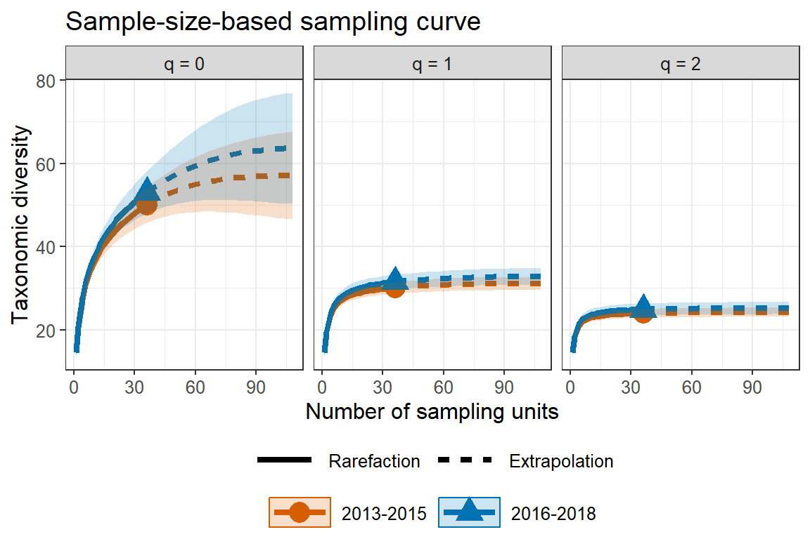

The following commands return the sample completeness (sample coverage)
curve (`type = 2`) in which different colors are used for different
assemblages.

``` r
# Sample completeness curves for incidence data, separating by "Assemblage"
ggiNEXTscaling(output_TD_inci, type = 2, color.var = "Assemblage")
```

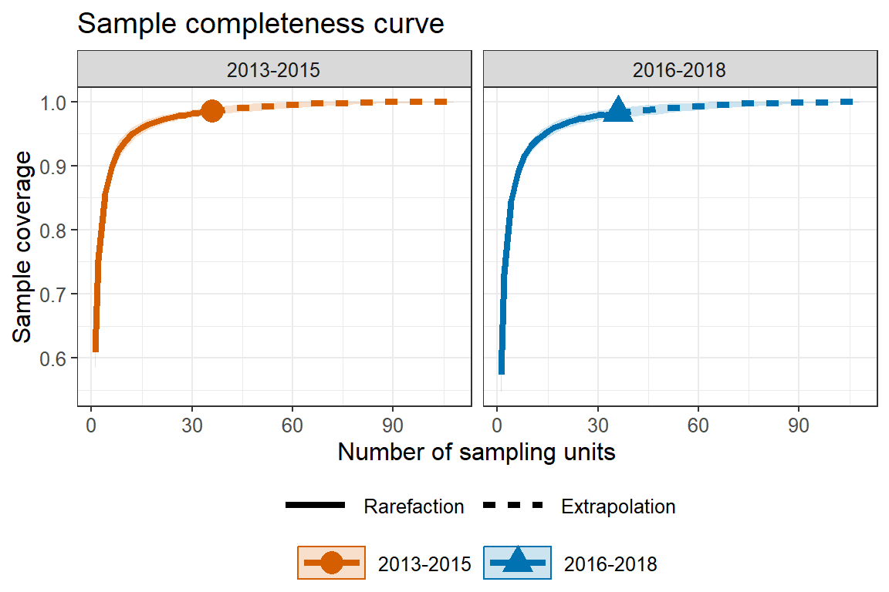

The following commands return the coverage-based
rarefaction/extrapolation sampling curves in which different color
curves represent three diversity orders within each assemblage
(`facet.var = "Assemblage"`), or represent two assemblages within each
diversity order (`facet.var = "Order.q"`), respectively.

``` r
# TD coverage-based R/E curves for incidence data, separating by "Assemblage"
ggiNEXTscaling(output_TD_inci, type = 3, facet.var = "Assemblage")
```

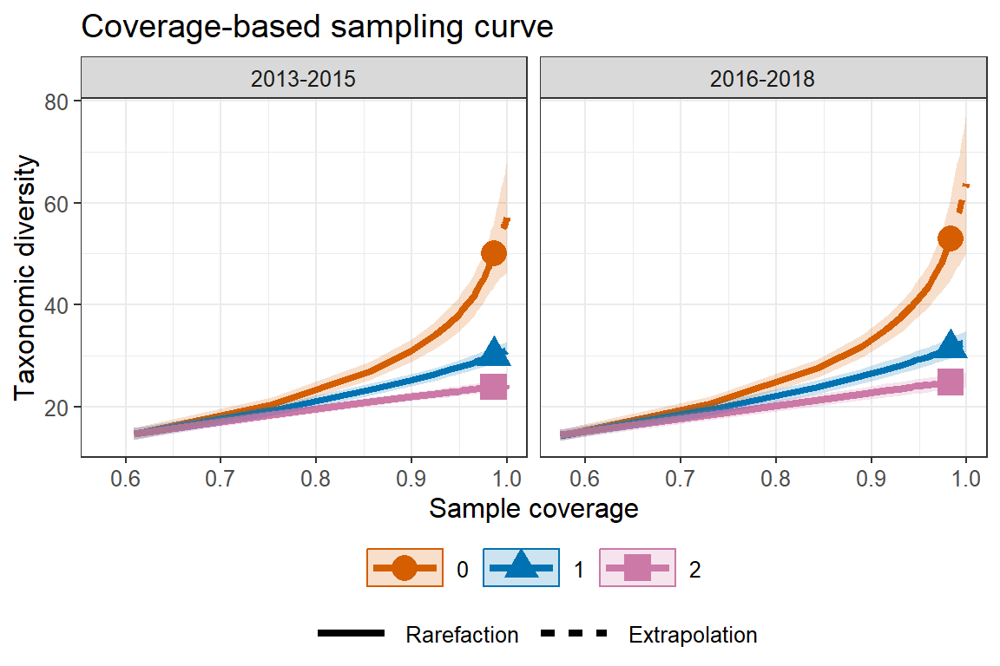

``` r
# TD coverage-based R/E curves for incidence data, separating by "Order.q"
ggiNEXTscaling(output_TD_inci, type = 3, facet.var = "Order.q")
```

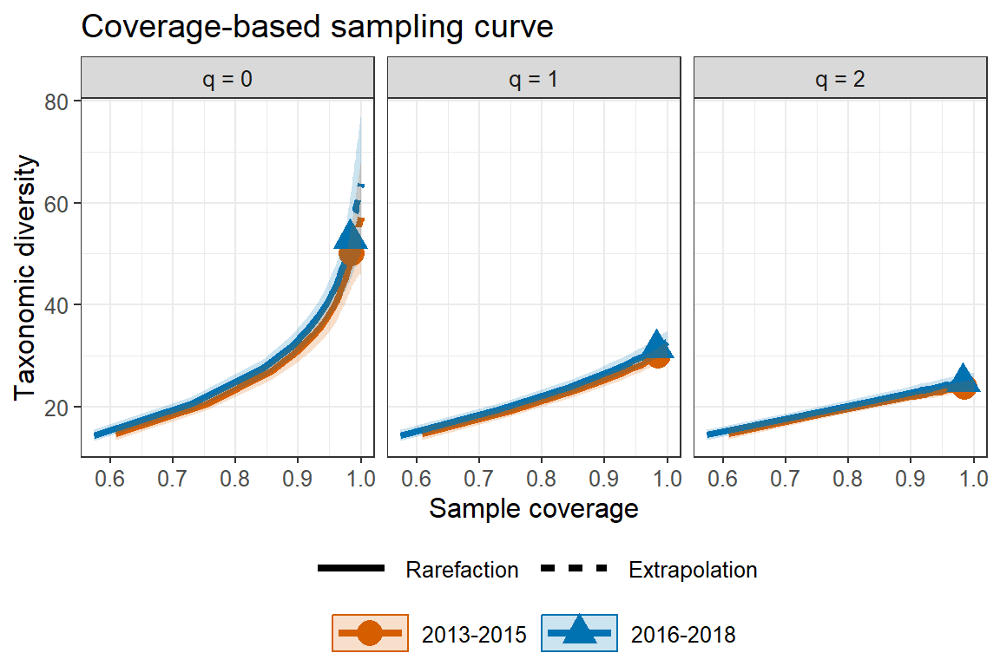

## <span style="color:red;">FUNCTION DataInfoscaling(): DATA INFORMATION</span>

The function `DataInfoscaling()` provides basic data information for the
reference sample in each individual assemblage. The function
`DataInfoscaling()` with default arguments is shown below:

``` r
DataInfoscaling(data, rho, datatype = "abundance", nT = NULL) 
```

All arguments in the above function are the same as those for the main
function `iNEXTscaling`. Running the `DataInfoscaling()` function
returns basic data information including sample size (`n`) or number of
sampling units (`T`) in the reference sample, total abundance (`N`) or
total number of sampling units (`T*`) in the overall assemblage,
sampling fraction of the reference sample (`rho`), total number of
incidences (`U`), observed species richness (`S.obs`), two sample
coverage estimates (`SC(n)` and `SC(2n)`) as well as the first five
species abundance counts (`f1`-`f5`) or incidence frequency counts
(`Q1`-`Q5`). We use `Brazil_rainforest_abun_data` and
`Fish_incidence_data` to demo the function for each dimension of
diversity. Assume that the rho of data is 0.3.

### Example 3: TAXONOMIC DIVERSITY (TD): Basic data information for abundance data

``` r
data(Brazil_rainforest_abun_data)
DataInfoscaling(Brazil_rainforest_abun_data, rho = 0.3, datatype = "abundance")
```

      Assemblage    n    N rho S.obs SC(n) SC(2n)  f1 f2 f3 f4 f5
    1       Edge 1794 5980 0.3   319 0.957  0.992 110 48 38 28 13
    2   Interior 2074 6913 0.3   356 0.958  0.991 123 48 41 32 19

Output description:

-   `Assemblage` = assemblage name.

-   `n` = number of observed individuals in the reference sample (sample
    size).

-   `N` = total abundance in the overall assemblage.

-   `rho` = sampling fraction of the reference sample.

-   `S.obs` = number of observed species in the reference sample.

-   `SC(n)` = sample coverage estimate of the reference sample with size
    n.

-   `SC(2n)` = sample coverage estimate of the reference sample with
    size 2n.

-   `f1`-`f5` = the first five species abundance frequency counts in the
    reference sample.

### Example 4: TAXONOMIC DIVERSITY (TD): Basic data information for incidence data

``` r
data(Fish_incidence_data)
DataInfoscaling(Fish_incidence_data, rho = 0.3, datatype = "incidence_raw")
```

      Assemblage  T  T* rho   U S.obs SC(T) SC(2T) Q1 Q2 Q3 Q4 Q5
    1  2013-2015 36 120 0.3 532    50 0.986  0.998 11  6  4  1  3
    2  2016-2018 36 120 0.3 522    53 0.983  0.996 13  5  5  2  3

Output description:

-   `Assemblage` = assemblage name.

-   `T` = number of sampling units in the reference sample (sample size
    for incidence data).

-   `T*` = total number of sampling units in the overall assemblage.

-   `rho` = sampling fraction of the reference sample.

-   `U` = total number of incidences in the reference sample.

-   `S.obs` = number of observed species in the reference sample.

-   `SC(T)` = sample coverage estimate of the reference sample with size
    T.

-   `SC(2T)` = sample coverage estimate of the reference sample with
    size 2T.

-   `Q1`-`Q5` = the first five species incidence frequency counts in the
    reference sample.

## <span style="color:red;">FUNCTION estimatescaling(): POINT ESTIMATION</span>

`estimatescaling` is used to compute diversity estimates with q = 0, 1,
2 under any specified levels of sample size (when `base = "size"`) and
sample coverage values (when `base = "coverage"`) for abundance data
(`datatype = "abundance"`) or incidence data
(`datatype = "incidence_raw"`). When `base = "size"`, `level` can be
specified with a particular vector of sample sizes (greater than 0); if
`level = NULL`, this function computes the diversity estimates for the
minimum sample size among all samples extrapolated to the maximum sample
sizes. When `base = "coverage"`, `level` can be specified with a
particular vector of sample coverage values (between 0 and 1); if
`level = NULL`, this function computes the diversity estimates for the
minimum sample coverage among all samples extrapolated to the maximum
sample sizes. Specifically, the maximum extrapolation limit is set to
double the reference sample size when `rho` is less than 0.2; triple the
reference sample size when `rho` is between 0.2 and 0.4; and the total
number of individuals when `rho` exceeds 0.4. All arguments in the
function are the same as those for the main function `iNEXTscaling`.

``` r
estimatescaling(data, rho, q = c(0,1,2), datatype = "abundance", base = "coverage", level = NULL, nboot = 50, conf = 0.95, nT = NULL) 
```

## <span style="color:blue;">TAXONOMIC DIVERSITY (TD): point estimation</span>

### Example 5a: TD for abundance data with two target coverage values (93% and 97%)

The following commands return the TD estimates with two specified levels
of sample coverage (93% and 97%) for the `Brazil_rainforest_abun_data`.
Assume that the rho of data is 0.3.

``` r
data(Brazil_rainforest_abun_data)
output_est_cov_abun <- estimatescaling(Brazil_rainforest_abun_data, rho = 0.3, q = c(0, 1, 2), 
                                       datatype = "abundance", base = "coverage", 
                                       level = c(0.93, 0.97))
output_est_cov_abun
```

       Assemblage Order.q   SC        m        Method     qTD   s.e. qTD.LCL qTD.UCL
    1        Edge       0 0.93 1214.713   Rarefaction 276.842  8.471 260.239 293.445
    2        Edge       0 0.97 2259.667 Extrapolation 344.431 12.727 319.487 369.375
    3        Edge       1 0.93 1214.713   Rarefaction 146.851  3.861 139.283 154.419
    4        Edge       1 0.97 2259.667 Extrapolation 160.012  4.218 151.746 168.278
    5        Edge       2 0.93 1214.713   Rarefaction  80.293  3.533  73.368  87.219
    6        Edge       2 0.97 2259.667 Extrapolation  82.794  3.733  75.477  90.112
    7    Interior       0 0.93 1340.309   Rarefaction 304.034  8.570 287.238 320.830
    8    Interior       0 0.97 2600.258 Extrapolation 384.202 11.708 361.255 407.148
    9    Interior       1 0.93 1340.309   Rarefaction 153.696  3.596 146.648 160.745
    10   Interior       1 0.97 2600.258 Extrapolation 167.903  3.811 160.435 175.372
    11   Interior       2 0.93 1340.309   Rarefaction  70.822  3.057  64.832  76.813
    12   Interior       2 0.97 2600.258 Extrapolation  72.658  3.180  66.425  78.891

### Example 5b: TD for abundance data with two target sizes values (1000 and 2000)

The following commands return the TD estimates with two specified levels
of sample sizes (1000 and 2000) for the `Brazil_rainforest_abun_data`.
Assume that the rho of data is 0.3.

``` r
data(Brazil_rainforest_abun_data)
output_est_size_abun <- estimatescaling(Brazil_rainforest_abun_data, rho = 0.3, q = c(0, 1, 2), 
                                        datatype = "abundance", base = "size", 
                                        level = c(1000, 2000))
output_est_size_abun
```

       Assemblage Order.q    m        Method    SC     qTD  s.e. qTD.LCL qTD.UCL
    1        Edge       0 1000   Rarefaction 0.912 256.210 4.413 247.560 264.860
    2        Edge       0 2000 Extrapolation 0.963 331.003 6.748 317.777 344.229
    3        Edge       1 1000   Rarefaction 0.912 141.864 3.920 134.181 149.547
    4        Edge       1 2000 Extrapolation 0.963 157.569 4.558 148.636 166.503
    5        Edge       2 1000   Rarefaction 0.912  79.183 3.627  72.074  86.291
    6        Edge       2 2000 Extrapolation 0.963  82.407 3.937  74.691  90.123
    7    Interior       0 1000   Rarefaction 0.903 270.303 4.963 260.575 280.030
    8    Interior       0 2000   Rarefaction 0.957 351.549 8.013 335.844 367.255
    9    Interior       1 1000   Rarefaction 0.903 145.685 3.818 138.201 153.168
    10   Interior       1 2000   Rarefaction 0.957 162.788 4.558 153.855 171.721
    11   Interior       2 1000   Rarefaction 0.903  69.588 4.103  61.547  77.629
    12   Interior       2 2000   Rarefaction 0.957  72.061 4.412  63.414  80.709

### Example 5c: TD for incidence data with two target coverage values (97.5% and 99%)

The following commands return the TD estimates with two specified levels
of sample coverage (97.5% and 99%) for the `Fish_incidence_data`. Assume
that the rho of data is 0.3.

``` r
data(Fish_incidence_data)
output_est_cov_inci <- estimatescaling(Fish_incidence_data, rho = 0.3, q = c(0, 1, 2), 
                                       datatype = "incidence_raw", base = "coverage", 
                                       level = c(0.975, 0.99))
output_est_cov_inci
```

       Assemblage Order.q    SC     mT        Method    qTD  s.e. qTD.LCL qTD.UCL
    1   2013-2015       0 0.975 23.343   Rarefaction 45.261 2.438  40.482  50.039
    2   2013-2015       0 0.990 44.266 Extrapolation 52.162 3.400  45.498  58.826
    3   2013-2015       1 0.975 23.343   Rarefaction 29.382 0.870  27.676  31.087
    4   2013-2015       1 0.990 44.266 Extrapolation 30.398 0.877  28.678  32.118
    5   2013-2015       2 0.975 23.343   Rarefaction 23.734 0.554  22.648  24.819
    6   2013-2015       2 0.990 44.266 Extrapolation 24.040 0.555  22.952  25.128
    7   2016-2018       0 0.975 25.954   Rarefaction 48.916 2.681  43.662  54.170
    8   2016-2018       0 0.990 50.988 Extrapolation 57.493 4.620  48.439  66.548
    9   2016-2018       1 0.975 25.954   Rarefaction 30.932 1.071  28.832  33.032
    10  2016-2018       1 0.990 50.988 Extrapolation 32.068 1.151  29.813  34.323
    11  2016-2018       2 0.975 25.954   Rarefaction 24.695 0.843  23.042  26.348
    12  2016-2018       2 0.990 50.988 Extrapolation 25.038 0.888  23.298  26.779

### Example 5d: TD for incidence data with two target sizes values (30 and 40)

The following commands return the TD estimates with two specified levels
of sample sizes (30 and 40) for the `Fish_incidence_data`. Assume that
the rho of data is 0.3.

``` r
data(Fish_incidence_data)
output_est_size_inci <- estimatescaling(Fish_incidence_data, rho = 0.3, q = c(0, 1, 2), 
                                        datatype = "incidence_raw", base = "size", 
                                        level = c(30, 40))
output_est_size_inci
```

       Assemblage Order.q mT        Method    SC    qTD  s.e. qTD.LCL qTD.UCL
    1   2013-2015       0 30   Rarefaction 0.982 48.012 2.241  43.620  52.405
    2   2013-2015       0 40 Extrapolation 0.988 51.117 2.778  45.672  56.562
    3   2013-2015       1 30   Rarefaction 0.982 29.818 0.957  27.941  31.694
    4   2013-2015       1 40 Extrapolation 0.988 30.248 0.987  28.314  32.182
    5   2013-2015       2 30   Rarefaction 0.982 23.877 0.731  22.444  25.310
    6   2013-2015       2 40 Extrapolation 0.988 24.003 0.739  22.555  25.451
    7   2016-2018       0 30   Rarefaction 0.979 50.700 1.721  47.327  54.073
    8   2016-2018       0 40 Extrapolation 0.985 54.354 2.160  50.121  58.588
    9   2016-2018       1 30   Rarefaction 0.979 31.215 0.823  29.602  32.828
    10  2016-2018       1 40 Extrapolation 0.985 31.695 0.843  30.042  33.348
    11  2016-2018       2 30   Rarefaction 0.979 24.788 0.651  23.512  26.064
    12  2016-2018       2 40 Extrapolation 0.985 24.940 0.656  23.654  26.225

## <span style="color:red;">FUNCTION ObsAsyscaling: ASYMPTOTIC AND OBSERVED DIVERSITY PROFILES</span>

``` r
ObsAsyscaling(data, rho, q = seq(0, 2, 0.2), datatype = "abundance", nboot = 50, conf = 0.95, nT = NULL, method = c('Asymptotic', 'Observed'))
```

All arguments in the above function are the same as those for the main
function `iNEXTscaling` (except that the default of `q` here is
`seq(0, 2, 0.2)`). The function `ObsAsyscaling()` computes observed and
asymptotic diversity of order q between 0 and 2 (in increments of 0.2)
for diversity; these values with different order q can be used to depict
a q-profile in the `ggObsAsyscaling` function. By default, both the
observed and asymptotic diversity estimates will be computed.

## <span style="color:red;">FUNCTION ggObsAsyscaling(): GRAPHIC DISPLAYS OF DIVERSITY PROFILES</span>

``` r
ggObsAsyscaling(output)
```

`ggObsAsyscaling` is a ggplot2 extension for an `ObsAsyscaling` object
to plot q-profile (which depicts the observed diversity and asymptotic
diversity estimate with respect to order q) for q between 0 and 2 (in
increments of 0.2) in default.

In the plot of profiles, only confidence intervals of the asymptotic
diversity will be shown when both the observed and asymptotic diversity
estimates are computed.

## <span style="color:blue;">TAXONOMIC DIVERSITY (TD): q-profiles</span>

### Example 6: TD q-profiles for abundance data

The following commands returns the observed and asymptotic taxonomic
diversity for the `Brazil_rainforest_abun_data`, along with its
confidence interval for diversity order q between 0 to 2. Assume that
the rho of data is 0.3. Here only the first ten rows of the output are
shown.

``` r
data(Brazil_rainforest_abun_data)
output_ObsAsy_TD_abun <- ObsAsyscaling(Brazil_rainforest_abun_data, rho = 0.3, 
                                       datatype = "abundance")
output_ObsAsy_TD_abun
```

       Assemblage Order.q     qTD   s.e. qTD.LCL qTD.UCL     Method
    1        Edge     0.0 403.499 16.817 370.538 436.460 Asymptotic
    2        Edge     0.2 343.375 12.200 319.463 367.287 Asymptotic
    3        Edge     0.4 289.135  8.756 271.973 306.297 Asymptotic
    4        Edge     0.6 242.108  6.525 229.319 254.897 Asymptotic
    5        Edge     0.8 202.771  5.317 192.351 213.192 Asymptotic
    6        Edge     1.0 170.756  4.766 161.414 180.098 Asymptotic
    7        Edge     1.2 145.125  4.534 136.238 154.012 Asymptotic
    8        Edge     1.4 124.720  4.426 116.045 133.396 Asymptotic
    9        Edge     1.6 108.435  4.362  99.886 116.983 Asymptotic
    10       Edge     1.8  95.338  4.310  86.890 103.786 Asymptotic

The following commands plot the corresponding q-profiles, along with its
confidence interval for q between 0 to 2.

``` r
# q-profile curves
ggObsAsyscaling(output_ObsAsy_TD_abun)
```

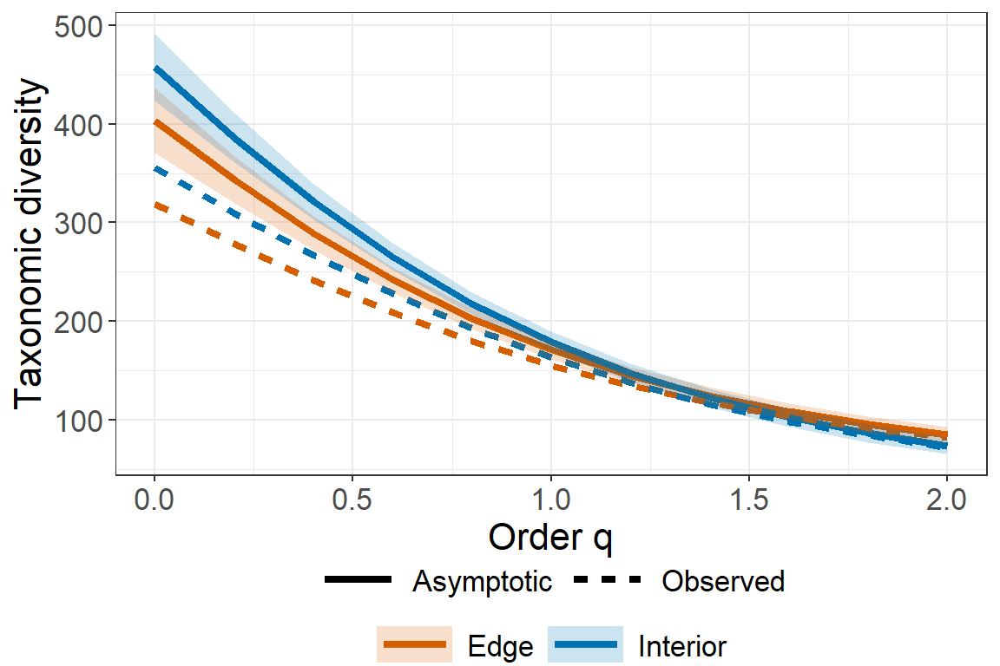

### Example 7: TD q-profiles for incidence data

The following commands return the observed and asymptotic taxonomic
diversity estimates for the `Fish_incidence_data`, along with its
confidence interval for diversity order q between 0 to 2. Assume that
the rho of data is 0.3. Here only the first ten rows of the output are
shown.

``` r
data(Fish_incidence_data)
output_ObsAsy_TD_inci <- ObsAsyscaling(Fish_incidence_data, rho = 0.3, 
                                       datatype = "incidence_raw")
output_ObsAsy_TD_inci
```

       Assemblage Order.q    qTD  s.e. qTD.LCL qTD.UCL     Method
    1   2013-2015     0.0 57.196 5.796  45.836  68.555 Asymptotic
    2   2013-2015     0.2 48.844 3.851  41.296  56.392 Asymptotic
    3   2013-2015     0.4 42.418 2.313  37.884  46.951 Asymptotic
    4   2013-2015     0.6 37.527 1.505  34.578  40.477 Asymptotic
    5   2013-2015     0.8 33.858 1.128  31.647  36.069 Asymptotic
    6   2013-2015     1.0 31.103 0.954  29.234  32.972 Asymptotic
    7   2013-2015     1.2 29.012 0.858  27.331  30.694 Asymptotic
    8   2013-2015     1.4 27.397 0.793  25.844  28.951 Asymptotic
    9   2013-2015     1.6 26.125 0.742  24.670  27.579 Asymptotic
    10  2013-2015     1.8 25.101 0.701  23.728  26.475 Asymptotic

The following commands plot the corresponding q-profiles, along with its
confidence interval for q between 0 to 2.

``` r
# q-profile curves
ggObsAsyscaling(output_ObsAsy_TD_inci)
```

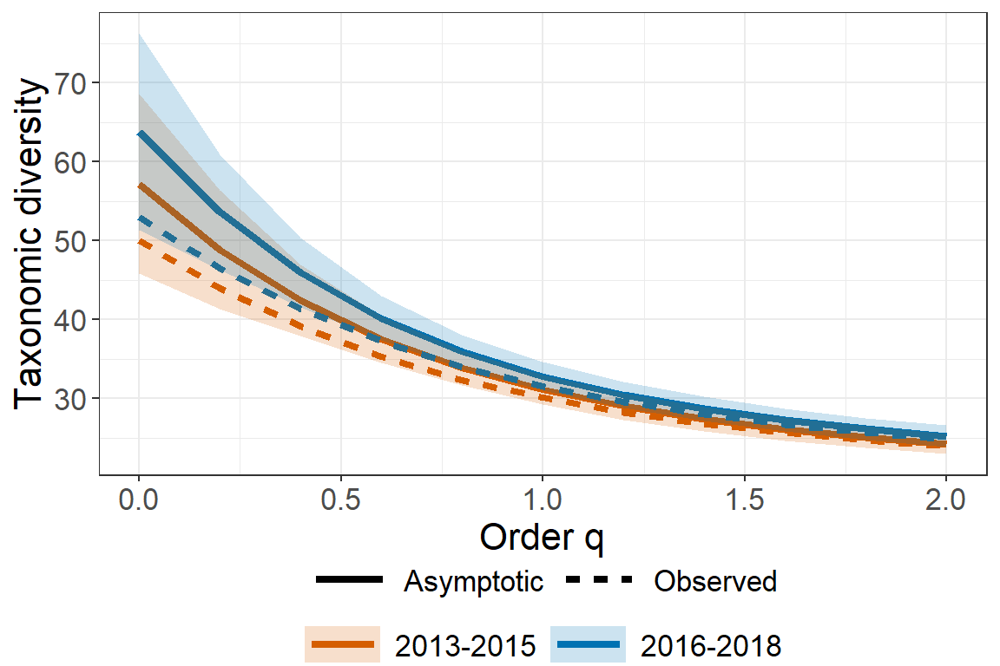

## License

The iNEXT.scaling package is licensed under the GPLv3. To help refine
`iNEXT.scaling`, your comments or feedback would be welcome (please send
them to Anne Chao or report an issue on the iNEXT.scaling github
[iNEXT.scaling_github](https://github.com/KaiHsiangHu/iNEXT.scaling).

## References
